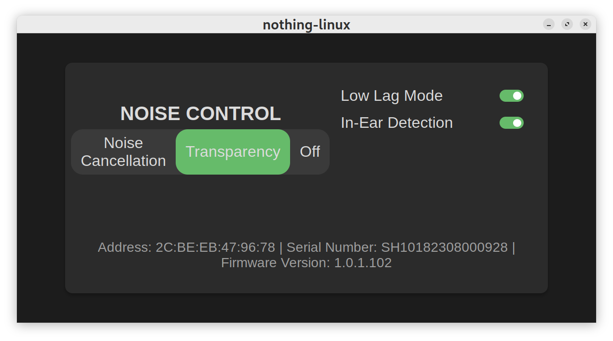
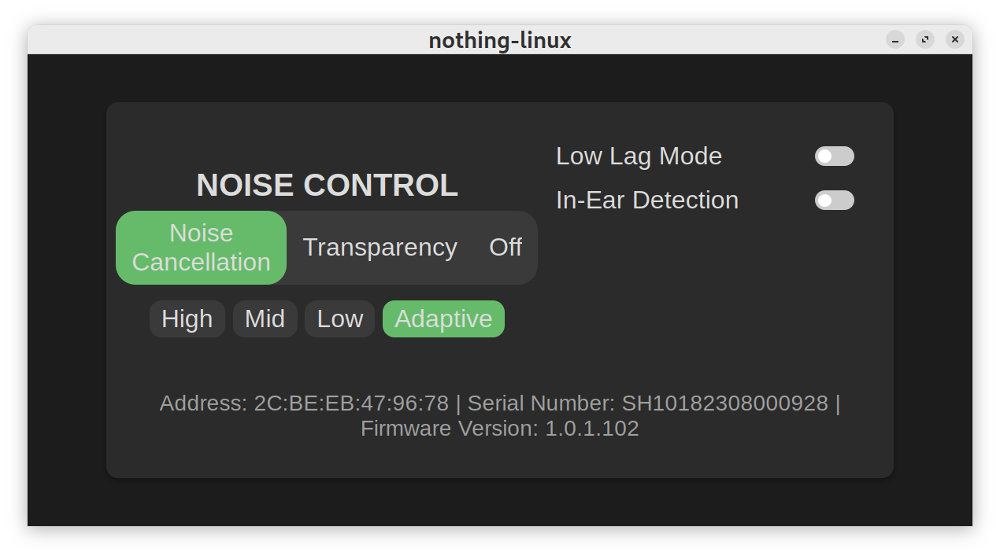

# Nothing Linux App

I usually have to enable low latency mode on my Nothing Ear (2) while gaming on Linux.
But because there is no official Linux app, I have to switch to my phone to do this (using dual connection).
So I made this simple app for Ear (2) for linux.

## Supported Devices

- Nothing Ear (2)

## Screenshots

## Install

You can find the latest rpm, deb or appimage in the [Releases](https://github.com/sn99/nothing-linux/releases) page.

Note: The app assumes you are connected to the bluetooth device already, not doing so will cause the app to crash.

## Architecture

It is made using:

- [Rust](https://www.rust-lang.org/)
- [Leptos 0.6.xx](https://docs.rs/leptos/0.6.14/leptos/index.html)
- [Tauri 2.0](https://v2.tauri.app/)

The project is structured in three separate parts:

1. [nothing crate](nothing) - It contains the hardware specific code for the Ear (2).
2. [tauri](src-tauri) - It contains the Tauri interface between the nothing crate and leptos frontend.
3. [leptos](src) - It contains the frontend code for the app.

### Hardware Abstraction

The project is written in such a way that future version of Nothing products could be supported by just modifying
the `nothing` crate.

The hardware is itself is treated as a [Struct](nothing/src/nothing_ear_2.rs) with controls in form
of [trait methods](nothing/src/lib.rs).
To add new hardware or modify existing hardware, you just need to implement the trait members.

You will most probably just need to copy-paste [nothing_ear_2_rs](nothing/src/nothing_ear_2.rs) with global const
changed to the new hardware's values.

### Structure

The `nothing` crate is used by `src-tauri` to create bindings for leptos frontend and that's about it.

#### Getting BLE Values

Your best bet is a rooted android device. Followed by running Android in a VM. I found this
helpful: [StackOverFlow](https://stackoverflow.com/questions/23877761/sniffing-logging-your-own-android-bluetooth-traffic)

## Building

### Prerequisites

- On fedora you need to install the following packages: `dbus-devel pkgconf-pkg-config`
- https://v2.tauri.app/start/prerequisites/
- https://book.leptos.dev/getting_started/index.html

### Steps

1. To run locally: `cargo tauri dev`
2. Tu build deb, rpm and appimage: `NO_STRIP=true cargo tauri build --verbose`

## Future

There are a few more commands that I have yet to add like personalized ANC, earfit test, setting shortcuts, etc, But I
don't really use those setting, feel free to open an issue if you need those features (no guarantees).